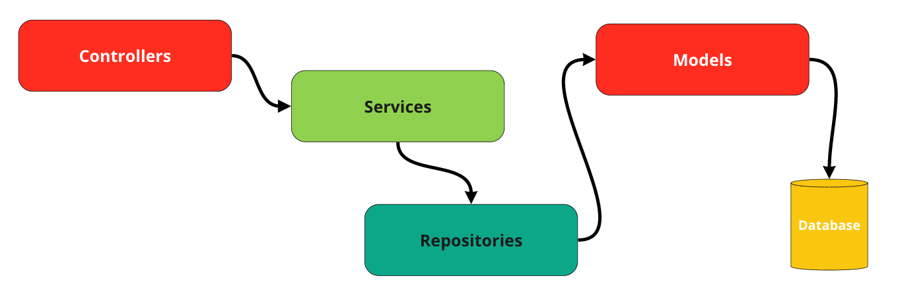

<p align="center"><a href="https://laravel.com" target="_blank"></a></p>

## Техническое задание

Написано последней версии фреймворка `Laravel` с использованием `Repository Pattern`

<p align="center"><a href="#" target="_blank"></a></p>

#### В дополнение к задаче были добавлены регистрация и аутентификация пользователей с использованием `Laravel Passport`.

## Как установить.

1. Создайте `.env` файл из файля `.env.example`.
2. В .env файле измените и задайте правильные конфигурации для вашей базы `MySQL`.

#### Пожалуйста, выполните эту команду в корневой папке для установки базово настроенного `Laravel 11` приложения.
    sh install.sh

## Немного документации для этого паттерна

### 1. Контроллеры управляют REST-интерфейсом для бизнес-логики
### 2. Сервисы реализуют бизнес логику
### 3. Репозитории работают с базой данных с использованием моделей

### Важно

- Для каждой модели создайте репозиторий и интерфейс репозитория, расширяющий базовые. (См. пример `UserRepository` и `UserRepositoryInterface`)
- После регистрируйте репозиторий в `Providers/RepositoryServiceProvider.php`


- UserRepositoryInterface
```php
<?php

declare(strict_types=1);

namespace App\Repository;

interface UserRepositoryInterface extends BaseRepositoryInterface
{
    public function getByEmail(string $email);
}
```
- UserRepository
```php
<?php

declare(strict_types=1);

namespace App\Repository\Eloquent;

use App\Models\User;
use App\Repository\UserRepositoryInterface;
use Carbon\Carbon;

final class UserRepository
    extends BaseRepository
    implements UserRepositoryInterface
{
    public function __construct(
        User $model,
        private readonly Carbon $carbon
    )
    {
        parent::__construct($model);
    }

    public function getByEmail(string $email): User | bool
    {
        $user = $this->model->where('email', $email);

        if($user->exists())
            return $user->first();

        return false;
    }
}
```

## Важно для этого паттерна
- <font color="red"> Не вызывайте модели без репозитория. </font>


## В дополнение

### Просмотрите папку Clients.

Это не используется в задаче; вы можете просто увидеть, как я подключаю внешние API.

- Здесь представлены примеры созданного класса клиента для работы с внешними ресурсами. (См. пример клиента `Google`)

### Пользовательские команды

- php artisan make:service {{ TestService }}
- php artisan make:repository-interface {{ TestRepositoryInterface }}
- php artisan make:repo {{ TestRepository }}


### Системные требования
- php ^8.2
- Mysql 8
